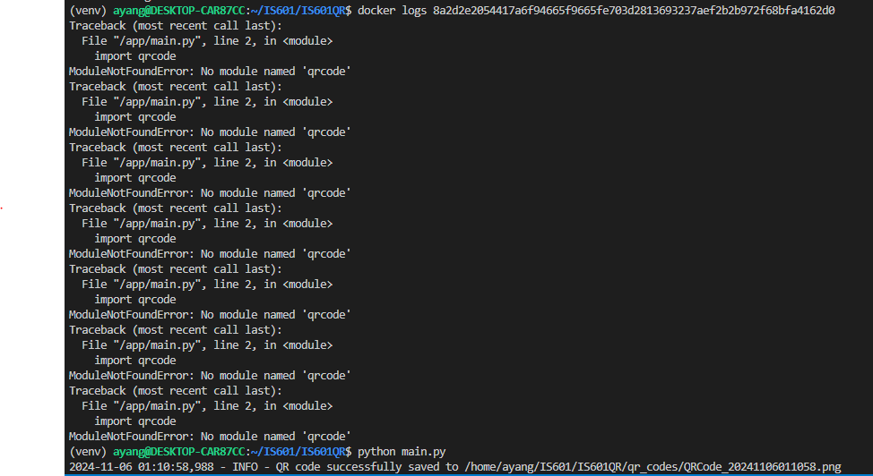

Logs - 

QR Code to my github - 

The logs show errors but when I run the code it's perfectly fine and the code has no errors. If someone can tell me why this may happen, I would really appreciate it.
